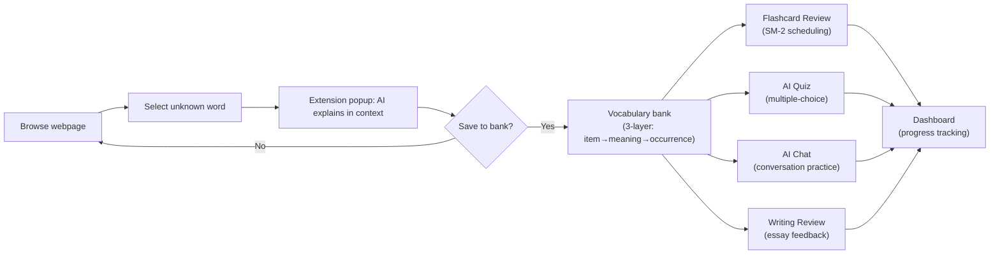

# Product Requirements Document — LinguaFlow

## 1. Executive Summary & Core Concept

**LinguaFlow** is an AI-assisted English learning system consisting of a Chrome Extension (contextual word capture) and a Web Application (spaced review, AI quizzes, AI chat & writing practice).

- **Core Differentiator:** Vocabulary is never learned as an isolated word. It is always saved and reviewed with its original context sentence.
- **Privacy Boundary:** The Extension operates strictly on explicit user selection + minimal context. It **never** scans or transmits full webpage DOMs.
- **Closed Learning Loop:** Encounter unknown word → Extension captures selection + minimal context → AI explains in-context → Save to bank → Scheduled Flashcard Review → AI Multiple-Choice Quiz → AI Chat & Writing Application → Dashboard Tracking.

## 2. Goals & Non-Goals

### Goals
- **G1 (Zero Friction):** Instant in-context lookup without leaving the active reading page.
- **G2 (Context Preservation):** Retain sentence context, source URL, and specific meaning for every saved item.
- **G3 (Loop Closure):** Transform passive lookups into active, scheduled spaced reviews and AI quizzes.
- **G4 (Active Application):** Provide AI chat and writing review tools to practice using saved vocabulary.

### Non-Goals (Strictly Out of MVP Scope)
- Full-page DOM scanning, passive page monitoring, or general document translation.
- YouTube/Netflix subtitle integration, dictation, shadowing, or speech/pronunciation recognition.
- Non-multiple-choice quiz types (fill-in-the-blank, listening, writing quizzes).
- Full AI tutoring (syllabus management, adaptive grade-level curriculum).
- Export to CSV/Anki, team/classroom sharing, or complex gamification streaks.
- Social features (leaderboards, friends, shared decks).
- Offline mode (Extension and Web both require network for AI calls).

## 3. Target User & JTBD

- **Primary User:** University students & young adults (B1–B2 level) reading English content online.
- **JTBD-1 (In-Context Lookup):** Understand words in their exact current sentence without losing reading momentum.
- **JTBD-2 (Contextual Saving):** Preserve words along with original sentences to remember usage.
- **JTBD-3 (Spaced Recall):** Receive automated review prompts based on memory decay.
- **JTBD-4 (Self-Testing):** Validate retention through AI-generated quizzes.
- **JTBD-5 (Application):** Practice using saved words in AI chat conversations and essays.

## 4. Priority Tiers

All functional requirements are classified into two priority tiers:

| Tier | Definition | Modules |
|---|---|---|
| **P0 — Launch Blocker** | Must be fully functional before first release. Without these, the core learning loop is broken. | Auth, Extension Capture, Vocabulary Management, Flashcard Review |
| **P1 — MVP Enrichment** | Should ship with MVP but can be stubbed or deferred 1–2 sprints without breaking the core loop. | Quiz, AI Chat, Writing Review, Dashboard & Settings |

> **Rule:** All P0 features must pass acceptance criteria and have e2e test coverage before any P1 work begins.

## 5. User Journey — High-Level Flow

## 6. Functional Requirements (FR)

### 6.1 Authentication — P0

**FR-AUTH-001: Registration & Login**
- Users can register with email + password, log in, and log out.
- _AC-1:_ Register with valid email + password (≥ 8 chars) → receive `accessToken`, `refreshToken`, `user` object.
- _AC-2:_ Register with duplicate email → `VALIDATION_ERROR` with message "email already exists".
- _AC-3:_ Login with incorrect password → `UNAUTHORIZED` error, no token issued.
- _AC-4:_ Logout → server invalidates `refreshTokenHash`, returns `{ success: true }`.

**FR-AUTH-002: Shared Session (Web ↔ Extension)**
- Maintain active authenticated sessions shared seamlessly between Web and Extension.
- _AC-1:_ User logs in on Web → Extension reads the same `accessToken` from `chrome.storage.local` → API calls succeed.
- _AC-2:_ User logs in on Extension popup → Web can use the same token → API calls succeed.

**FR-AUTH-003: Protected Actions**
- Require valid auth token before allowing any vocabulary save, review, quiz, chat, or writing action.
- _AC-1:_ Any protected endpoint called without `Authorization` header → `401 UNAUTHORIZED`.
- _AC-2:_ Any protected endpoint called with expired token → `401 UNAUTHORIZED` (client triggers silent refresh).

**FR-AUTH-004: Silent Token Refresh**
- When `accessToken` expires, the client automatically requests a new one using `refreshToken` without user interaction.
- _AC-1:_ `accessToken` expires → client calls `POST /auth/refresh` with `refreshToken` → receives new `accessToken` → retries the original request transparently.
- _AC-2:_ `refreshToken` is also expired or invalid → redirect user to login screen with message "Session expired. Please log in again."
- _AC-3:_ Extension `background` service worker owns refresh logic; `content script` never holds tokens directly.

**FR-AUTH-005: Session Expiry Handling**
- Clearly communicate session state to the user.
- _AC-1:_ `accessToken` TTL: 15 minutes. `refreshToken` TTL: 7 days.
- _AC-2:_ After 7 days of inactivity → user must re-authenticate. No "remember me forever" in MVP.
- _AC-3:_ Extension popup shows "Logged out" state with a login button when no valid session exists.

### 6.2 Chrome Extension — Contextual Capture — P0

**FR-EXT-001: Text Selection Detection**
- Detect native user text selection (`selectionchange`/`mouseup`) on any standard HTML page.
- _AC-1:_ User highlights text → content script detects non-empty selection within 100ms.
- _AC-2:_ No popup appears if selection is empty, whitespace-only, or exceeds 200 characters.
- _AC-3:_ Content script only activates on explicit user action — never on page load, scroll, or timer.

**FR-EXT-002: Context Capture**
- Capture exact `selectedText` + minimum surrounding `contextText` (immediate parent sentence).
- _AC-1:_ `selectedText` = exact user highlight. `contextText` = surrounding sentence or ≤ 300 characters of parent element text.
- _AC-2:_ `sourceUrl` = current `window.location.href`. `sourceTitle` = current `document.title`.
- _AC-3:_ **NEVER** access `document.body.innerText` or serialize full DOM (privacy boundary — `ARCHITECTURE.md` §8).

**FR-EXT-003: AI In-Context Explanation**
- Display AI-generated in-context meaning and 1 relevant example sentence.
- _AC-1:_ After selection, popup shows loading spinner within 200ms.
- _AC-2:_ AI response renders within 5 seconds (p95) showing `meaning` + `example`.
- _AC-3:_ If AI call takes > 10 seconds → abort and show timeout error with "Retry" button.

**FR-EXT-004: One-Click Save**
- One-click save to vocabulary bank (attaching original sentence + source URL).
- _AC-1:_ "Save" button creates the full `vocabularyItem → meaning → occurrence` chain via `POST /vocabulary/occurrences`.
- _AC-2:_ On success → button changes to "Saved ✓" (disabled), popup stays open for 2 seconds then auto-closes.
- _AC-3:_ If the same `(lemma, definition)` pair already exists, a new occurrence is added under the existing meaning (not duplicated).

**FR-EXT-005: Loading & Error States**
- Display explicit loading spinner and non-silent error states.
- _AC-1:_ Loading spinner is visible during AI lookup and save operations.
- _AC-2:_ API timeout → "Lookup failed. Retry?" with a clickable retry button.
- _AC-3:_ Save failure → preserve captured input in popup state, show "Save failed. Retry?" button for 1-click retry.
- _AC-4:_ Network offline → "You are offline. Check your connection."

**FR-EXT-006: Privacy Enforcement**
- Only process user-selected text + minimal context. **NEVER** scan, serialise, or transmit `document.body.innerText` or entire page DOM.
- _AC-1:_ Code review gate: any PR touching content script that reads beyond `selectedText` + parent sentence must be rejected.
- _AC-2:_ Extension `permissions` in `manifest.json` must not include `<all_urls>` for host permissions beyond `activeTab`.

### 6.3 Vocabulary Management (Web) — P0

**FR-VOCAB-001: Vocabulary List View**
- View saved vocabulary list grouped by `vocabularyItem` (lemma).
- _AC-1:_ Default view: paginated list sorted by `createdAt` descending (newest first).
- _AC-2:_ Each item shows: `lemma`, `meaningsCount`, `occurrencesCount`, `createdAt`.
- _AC-3:_ Click on item → expand to show meanings and their occurrences inline.

**FR-VOCAB-002: Mandatory Data Hierarchy**
- Enforce 3-layer structure: `vocabularyItem` (lemma) → `meaning` (specific sense) → `occurrence` (sentence + source + timestamp). **Never flatten into a single record.**
- _AC-1:_ "scale" saved from 2 different sentences with the same meaning → 1 vocabularyItem, 1 meaning, 2 occurrences.
- _AC-2:_ "scale" saved with 2 different meanings → 1 vocabularyItem, 2 meanings, 1+ occurrences each.
- _AC-3:_ No API endpoint or UI flow allows creating a vocabulary record that bypasses this chain.

**FR-VOCAB-003: Occurrence-Level CRUD**
- Allow users to view, edit, or delete individual occurrences without destroying the parent lemma.
- _AC-1:_ `PATCH /vocabulary/occurrences/:id` → update `sentence` or `meaning` fields only.
- _AC-2:_ `DELETE /vocabulary/occurrences/:id` → soft-delete occurrence; parent meaning and vocabularyItem remain.
- _AC-3:_ If all occurrences under a meaning are deleted → meaning is still preserved (user might re-encounter the word).
- _AC-4:_ User can delete an entire vocabularyItem → cascading soft-delete on all meanings + occurrences (see `DATA-SCHEMA.md` cascade policy).

**FR-VOCAB-004: Pagination**
- All list endpoints must support cursor-based or offset pagination.
- _AC-1:_ `GET /vocabulary` returns max 20 items per page by default. Supports `?page=N&limit=M` (max limit: 50).
- _AC-2:_ Response includes `{ items: [...], total: number, page: number, totalPages: number }`.
- _AC-3:_ `GET /vocabulary/:itemId/occurrences` returns max 20 occurrences per page with the same pagination shape.

**FR-VOCAB-005: Search & Filter**
- Users can search vocabulary by lemma text.
- _AC-1:_ `GET /vocabulary?search=scale` → returns items where `lemma` contains the search term (case-insensitive).
- _AC-2:_ Search is debounced on the frontend (300ms delay after last keystroke).
- _AC-3:_ Empty search returns the full paginated list.

### 6.4 Flashcard Review (Web) — P0

**FR-REVIEW-001: Fetch Due Items**
- Fetch due review items dynamically based on SM-2 scheduling.
- _AC-1:_ `GET /review/due` returns occurrences where `review.dueDate <= now` and `review.suspended = false` and `isDeleted = false`.
- _AC-2:_ Results are capped by user's `dailyReviewGoal` setting (default 20). If 50 cards are due but goal is 20, return 20 (oldest due first).
- _AC-3:_ If 0 cards are due → return empty array (frontend shows empty state — see EDGE-007).

**FR-REVIEW-002: Flashcard Display**
- Display flashcards showing original sentence context with target word highlighted.
- _AC-1:_ Card front: original `sentence` with `selectedText` visually highlighted (bold + color).
- _AC-2:_ Card back (revealed on tap/click): `meaning` (definition) + `example` sentence.
- _AC-3:_ Source URL displayed as small link below the sentence for reference.

**FR-REVIEW-003: Self-Assessment & Schedule Update**
- User self-assesses recall (Remembered / Forgot), updating the item's review schedule.
- _AC-1:_ "Remembered" → SM-2 algorithm updates `easeFactor`, `intervalDays`, `repetitions`, `dueDate` per `ARCHITECTURE.md` §9.
- _AC-2:_ "Forgot" → `repetitions = 0`, `intervalDays = 1`, `dueDate = tomorrow`.
- _AC-3:_ Response returns `{ nextDueDate, intervalDays }` so the UI can show "Next review in X days".
- _AC-4:_ After all due cards are reviewed → show completion screen: "All done! X cards reviewed today."

**FR-REVIEW-004: Suspend Card**
- User can suspend a card to temporarily remove it from the review queue.
- _AC-1:_ Suspend action sets `review.suspended = true` on the occurrence.
- _AC-2:_ Suspended cards do not appear in `GET /review/due` results.
- _AC-3:_ User can unsuspend from the Vocabulary detail view.

### 6.5 AI Multiple-Choice Quiz (Web) — P1

**FR-QUIZ-001: Quiz Generation**
- Generate multiple-choice quizzes sourced from user's vocabulary bank.
- _AC-1:_ `POST /quiz/generate` accepts `{ scope: "all" | "recent", count: N }` where `count` defaults to user's `quizDefaultCount` setting (default 10).
- _AC-2:_ "recent" scope = occurrences saved in the last 7 days. "all" scope = entire vocabulary bank.
- _AC-3:_ Questions are generated by `AiModule.generateQuiz()` and stored as an immutable snapshot in the `quizzes` collection.

**FR-QUIZ-002: Question Format**
- Questions MUST present **exactly 4 answer options**.
- _AC-1:_ Each question has `questionText`, `options[4]`, `correctIndex` (0–3), `explanation`.
- _AC-2:_ `correctIndex` and `explanation` are withheld from the client response until the question is answered.
- _AC-3:_ If AI returns fewer or more than 4 options → backend rejects and retries (max 2 retries) or returns `AI_PROVIDER_ERROR`.

**FR-QUIZ-003: Immediate Evaluation**
- Evaluate answers immediately upon selection.
- _AC-1:_ `POST /quiz/:id/answer` with `{ questionIndex, selectedIndex }` → returns `{ correct, correctIndex, explanation }`.
- _AC-2:_ Correct answer → green highlight + explanation. Wrong answer → red highlight on selected + green on correct + explanation.
- _AC-3:_ Each question can only be answered once — re-submission returns the same result without re-processing.

**FR-QUIZ-004: Score Recording**
- Record quiz scores and update learning statistics.
- _AC-1:_ After all questions are answered → quiz `status` changes to `completed`, `completedAt` is set.
- _AC-2:_ `quizResult` document is created with `score`, `totalQuestions`, per-question `answers[]`.
- _AC-3:_ `GET /quiz/:id/result` returns full result summary.

**FR-QUIZ-005: Quiz History**
- Users can view past quiz results.
- _AC-1:_ `GET /quiz/history` returns paginated list of completed quizzes (default 10/page), sorted by `completedAt` descending.
- _AC-2:_ Each entry shows: `score/total`, `scope`, `completedAt`.
- _AC-3:_ Click on entry → view full quiz with questions, user answers, correct answers, and explanations.

### 6.6 AI Chat (Web) — P1

**FR-CHAT-001: Conversational Chat**
- Free-form conversational English chat interface.
- _AC-1:_ `POST /chat/message` with `{ message }` (no `sessionId`) → creates a new session, returns `{ sessionId, reply }`.
- _AC-2:_ `POST /chat/message` with `{ sessionId, message }` → continues existing session, returns `{ sessionId, reply }`.
- _AC-3:_ AI responds in English, correcting user mistakes inline when detected, and naturally encouraging use of vocabulary from the user's bank.

**FR-CHAT-002: Vocabulary Chip Suggestions**
- Suggest relevant saved vocabulary chips above the chat input for user insertion.
- _AC-1:_ When chat input is focused, show up to 5 vocabulary chips randomly selected from user's recent saves.
- _AC-2:_ Clicking a chip inserts the lemma into the input field at cursor position.
- _AC-3:_ Chips refresh on each new message send.

**FR-CHAT-003: Session Management**
- Users can view, continue, and delete chat sessions.
- _AC-1:_ `GET /chat/sessions` returns paginated list of sessions sorted by `updatedAt` descending (default 10/page).
- _AC-2:_ Each session shows: `title` (auto-generated from first message excerpt), `updatedAt`, message count.
- _AC-3:_ `DELETE /chat/sessions/:id` → soft-delete the session. Deleted sessions do not appear in the list.
- _AC-4:_ Clicking a session → loads full message history and allows continuing the conversation.

### 6.7 Writing Review (Web) — P1

**FR-WRITING-001: Submit & Review**
- Submit text paragraphs → receive AI feedback.
- _AC-1:_ `POST /writing/review` with `{ text }` (min 20 characters, max 5000 characters) → returns `{ feedback, suggestions[] }`.
- _AC-2:_ `feedback` = overall prose commentary on grammar, style, and coherence.
- _AC-3:_ `suggestions[]` = list of specific, actionable improvement points with before/after examples where applicable.

**FR-WRITING-002: Writing History**
- Users can view past writing submissions and their feedback.
- _AC-1:_ `GET /writing/history` returns paginated list of submissions sorted by `createdAt` descending (default 10/page).
- _AC-2:_ Each entry shows: first 100 characters of `originalText` (truncated), `wordCount`, `createdAt`, suggestion count.
- _AC-3:_ Click on entry → view full `originalText` + `feedback` + `suggestions[]`.

### 6.8 Dashboard & Settings — P1

**FR-DASH-001: Dashboard Overview**
- Display aggregated learning progress.
- _AC-1:_ `GET /dashboard/stats` returns: `dueCount`, `totalSaved`, `totalReviewed`, `recentQuizzes` (last 5), `recentActivity` (last 10 events).
- _AC-2:_ "Due count" badge is visible in the main navigation bar at all times.
- _AC-3:_ Recent activity log shows timestamped entries: "Saved 'scale'", "Reviewed 5 cards", "Quiz score 8/10", etc.

**FR-DASH-002: Weekly Progress Summary**
- Show visual weekly progress.
- _AC-1:_ Display a 7-day activity heatmap or bar chart showing: words saved, cards reviewed, quizzes completed per day.
- _AC-2:_ Show progress toward `dailyReviewGoal` for the current day (e.g., "12/20 cards reviewed today").

**FR-SETTINGS-001: User Profile & Preferences**
- Manage basic user profile and study goal preferences.
- _AC-1:_ Editable fields: `displayName`, `avatarUrl`, `dailyReviewGoal`, `quizDefaultCount`, `timezone`.
- _AC-2:_ `PATCH /users/me/settings` → validates and updates user settings.
- _AC-3:_ `timezone` defaults to browser-detected timezone on registration; used for `dueDate` boundary calculation.

## 7. Edge Cases & Error Handling (EDGE)

- **EDGE-001:** *Empty/Short Selection:* Extension must not trigger AI requests if selection is empty, whitespace-only, or exceeds 200 characters.
- **EDGE-002:** *Insufficient Context:* If context is too short to disambiguate meaning, AI indicates low-confidence rather than hallucinating an exact definition.
- **EDGE-003:** *AI Failure / Timeout:* Show clear error UI ("Lookup failed. Retry?") — never fail silently or hang infinitely in loading state. Timeout threshold: 10 seconds.
- **EDGE-004:** *Save Failure:* If database save fails, preserve user's captured input in popup state and allow 1-click retry.
- **EDGE-005:** *Malformed AI JSON:* If AI fails structured output validation, retry once. If second attempt also fails, return `AI_PROVIDER_ERROR` with user-friendly message.
- **EDGE-006:** *Unauthenticated Action:* Extension/Web intercepts 401 responses → attempts silent token refresh → if refresh fails, prompts login UI instead of showing raw error.
- **EDGE-007:** *No Due Cards:* Display clean empty state with CTA to "Capture more words" or "Take a Quiz".
- **EDGE-008:** *Zero Saved Words (New User):* Display onboarding guidance pointing to Extension installation and first capture flow. Dashboard shows welcome message instead of empty charts.
- **EDGE-009:** *Insufficient Quiz Items:* If user has < 4 saved occurrences, show warning "You need at least 4 saved words to generate a quiz. Keep learning!" and disable the generate button.
- **EDGE-010:** *Concurrent Session Conflict:* If user is logged in on multiple tabs/devices and refreshes token simultaneously, only the latest `refreshTokenHash` is valid — other sessions silently re-authenticate on next request.
- **EDGE-011:** *Rate Limit Hit:* Show user-friendly message "You've reached today's limit for this feature. Try again tomorrow." with countdown timer if rate-limit headers are available.
- **EDGE-012:** *Extremely Long AI Response:* If AI response for chat or writing exceeds 5000 characters, truncate and append "... (response truncated)".

## 8. Non-Functional Requirements (NFR)

### 8.1 Performance

| Metric | Target | Measurement |
|---|---|---|
| Extension popup render | < 200ms | Time from selection to spinner visible |
| AI lookup response (p50) | < 2s | Server-side, excluding network latency |
| AI lookup response (p95) | < 5s | Server-side, including Gemini API call |
| API response (non-AI endpoints) | < 300ms | Server-side p95 |
| Web SPA initial load | < 3s | Lighthouse First Contentful Paint on 4G |
| Flashcard transition | < 100ms | Time from button click to next card render |

### 8.2 Scalability

| Aspect | Target |
|---|---|
| Concurrent users (MVP) | 100 simultaneous |
| Vocabulary items per user | Up to 10,000 without degradation |
| Chat messages per session | Up to 200 messages (embedded array — extract to collection if exceeded) |
| Quiz history per user | Unlimited (paginated queries) |

### 8.3 Reliability & Availability

| Aspect | Target |
|---|---|
| Uptime (MVP, single-server) | 99% monthly (allows ~7h downtime/month for maintenance) |
| Data durability | MongoDB replica set recommended; daily backups minimum |
| Graceful degradation | If Gemini API is down → lookup/quiz/chat/writing show error; review (pure SM-2) continues working |

### 8.4 Security

- All requirements from `PROJECT-RULES.md` §Security apply.
- JWT `accessToken` TTL: 15 minutes. `refreshToken` TTL: 7 days. Refresh token rotation on each use.
- Rate limiting per user on AI-heavy endpoints (see `ARCHITECTURE.md` §7).
- Input sanitization: all user-submitted text is sanitized before rendering (XSS prevention). No `innerHTML` or `eval()`.
- CORS: backend allows origins for Web domain + `chrome-extension://<extension-id>` only.

### 8.5 Accessibility

| Aspect | Target |
|---|---|
| WCAG compliance | Level AA (MVP — best effort) |
| Keyboard navigation | All interactive elements reachable via Tab, activatable via Enter/Space |
| Screen reader | Semantic HTML, ARIA labels on interactive components |
| Color contrast | Minimum 4.5:1 ratio for normal text, 3:1 for large text |
| Focus indicators | Visible focus ring on all focusable elements |

### 8.6 Localization

| Aspect | Decision |
|---|---|
| UI language (MVP) | English only. UI strings are hardcoded (no i18n framework yet). |
| AI response language | English only. AI prompts specify English output. |
| Future consideration | If Vietnamese UI is needed post-MVP, extract strings to JSON locale files. Architecture supports this but MVP does not implement it. |

## 9. Technical & System Constraints

- **Data Architecture:** Monolith NestJS API serving React Web SPA and CRXJS Chrome Extension.
- **Data Integrity:** Strict Mongoose schemas adhering to 3-layer hierarchy (`vocabularyItem` → `meaning` → `occurrence`).
- **AI Abstraction:** All AI operations route through `AiModule` (`AIProvider` interface). No module directly imports Gemini SDK.
- **Security:** JWT bearer tokens. Tokens stored in `chrome.storage.local` for Extension (not `localStorage`). Passwords hashed with `bcrypt`. Never hardcode API keys.
- **Pagination:** All list endpoints return paginated responses. Default page size: 20. Maximum page size: 50.
- **Soft Delete:** All user-generated content uses soft-delete (`isDeleted` flag). Hard deletes are never performed. See `DATA-SCHEMA.md` cascade policy.
- **Caching:** AI lookup results cached by `hash(selectedText + contextText)` for 7 days (see `ARCHITECTURE.md` §7).

## 10. Success Metrics

| Metric | Definition | Target (30 days post-launch) |
|---|---|---|
| **Loop Closure Rate** (primary) | % of saved vocabulary items reviewed via flashcards or quizzes within 7 days | ≥ 40% |
| **Engagement** | Vocabulary items saved per active user per week | ≥ 10 |
| **Review Completion** | % of due flashcards reviewed on the day they are due | ≥ 60% |
| **Quiz Completion** | Started vs. completed quiz sessions | ≥ 70% completion rate |
| **Retention (W2)** | % of Week 1 active users who return in Week 2 | ≥ 30% |
| **Retention (W4)** | % of Week 1 active users who return in Week 4 | ≥ 15% |

## 11. Dependencies & Assumptions

### Dependencies
| Dependency | Risk | Mitigation |
|---|---|---|
| Gemini API availability | Medium — third-party service outage | Graceful degradation (§8.3); `AIProvider` interface allows future provider swap |
| Chrome Web Store review | Low — standard Extension, no unusual permissions | Follow Manifest V3 best practices; minimal permissions |
| MongoDB Atlas (or self-hosted) | Low — mature, managed service available | Daily automated backups; replica set for durability |

### Assumptions
- Users have Chrome browser (v116+ for full MV3 support).
- Users have stable internet connection (no offline mode in MVP).
- Gemini API free/paid tier provides sufficient quota for MVP user base (~100 users).
- Users read English content online regularly (at least 3x/week).

## 12. Out-of-Scope Decisions (Deferred Post-MVP)

| Decision | Current Status | Revisit When |
|---|---|---|
| Offline mode / service worker caching | Out of scope | User feedback indicates need |
| Multiple AI providers (OpenAI, Claude) | Architecture supports via `AIProvider` interface; only Gemini implemented | Gemini pricing/quality issues |
| Whitelisted vs. all websites | MVP assumes all websites | Content policy issues arise |
| Gamification (streaks, badges, XP) | Out of scope | Retention metrics below target |
| Mobile app (React Native) | Out of scope | Web app validated, mobile demand confirmed |
| Rate limit numbers | Placeholder values in `ARCHITECTURE.md` §7 | Tune after observing real Gemini API cost |
| Vietnamese UI localization | English-only MVP | User base demographics require it |